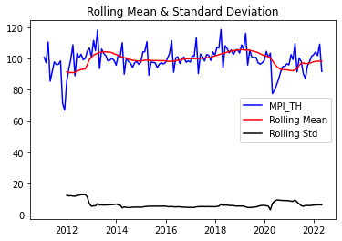

24 Aug [2022](/blog/2022/)
# Time series data testing (Stationary & Non-stationary) via Python
ในบทความนี้เราจะมาเล่าถึงวิธีการทดสอบข้อมูลอนุกรมเวลา หรือ Time series data เพื่อใช้สำหรับการพยากรณ์ตัวเลขทางสถิติ

สำหรับข้อมูลอนุกรมเวลา ก่อนที่เราจะนำไปเข้าโมเดลแบบจำลองเพื่อพยากรณ์ตัวแปรต่างๆได้นั้น มีความจำเป็นอย่างยิ่งที่จะต้องทำการทดสอบก่อนว่า ข้อมูลดังกล่าวมีลักษณะนิ่ง (Stationary) หรือไม่ ถ้าข้อมูลมีลักณะนิ่ง ถึงจะสามารถนำข้อมูลดังกล่าวไปทำการพยากรณ์ได้ในแบบจำลองต่างๆ ที่กำหนดไว้

อย่างไรก็ตาม คุณลักษณะของข้อมูล Time series ที่มีลักษณะนิ่งนั้นจะต้องประกอบไปด้วยคุณลักษณะ 3 ประการ ตามสมการที่กำหนดไว้ ดังนี้

	E(Yt) = μ			(1.)

(1.) ค่าเฉลี่ยของข้อมูลอนุกรมเวลา Yt จะต้องมีค่าคงที่เมื่อเวลาเปลี่ยนแปลงไป

	Var(Yt) = E(Yt - μ)^2 = σ^2			(2.)

(2.) ค่าความแปรปรวนของข้อมูลอนุกรมเวลา Yt จะต้องมีค่าคงที่เมื่อเวลาเปลี่ยนแปลงไป และ

	E[(Yt - μ)(Yt+k - μ)] = Υk			(3.)

(3.) ค่าความแปรปรวนร่วมของข้อมูลอนุกรมเวลา Yt จะต้องมีการเปลี่ยนแปลงไปแค่ใน 2 ช่วงเวลาเท่านั้น

ในทางกลับกันถ้าข้อมูลมีลักษณะไม่นิ่ง (Non-stationary) แสดงว่า ค่าเฉลี่ยของข้อมูลอนุกรมเวลา Yt จะมีค่าเปลี่ยนแปลงไปเมื่อเวลาเปลี่ยนแปลงไป ค่าความแปรปรวนของข้อมูลอนุกรมเวลา Yt จะมีค่าเปลี่ยนแปลงไปเมื่อเวลาเปลี่ยนแปลง และ ค่าความแปรปรวนร่วมของข้อมูลอนุกรมเวลา Yt จะมีการเปลี่ยนแปลงไปมากกว่่าใน 2 ช่วงเวลา ดังนี้

	E(Yt) = tμ
	Var(Yt) = E(Yt - μ)^2 = tσ^2
	E[(Yt - μ)(Yt+k - μ)] = tΥk

หลังจากที่กล่าวมาในข้างต้น ทำให้เราทราบได้ถึงความแตกต่างของข้อมูลอนุกรมเวลา หรือ Time series data ระหว่างข้อมูลที่มีลักษณะนิ่ง (Stationary) และข้อมูลที่มีลักษณะไม่นิ่ง (Non-stationary) ทั้งนี้ ในส่วนถัดไปเราจะเข้าสู่เนื้อหาหลักของบทความนี้ นั่นคือ การทดสอบความนิ่งของข้อมูลที่ใช้ในการพยากรณ์ หรือที่เรียกว่า Unit root test

## Unit root test
โดยการทดสอบความนิ่งของข้อมูลที่ใช้ในการพยากรณ์นี้มีอยู่หลากหลายวิธี ไม่ว่าจะเป็น ADF-Test, PP-Test, KPSS Test, and etc. ซึ่งในบทความนี้จะเลือกวิธีการทดสอบแบบ ADF-Test (Augmented Dickey-Fuller test, Dickey, D.A. and W.A. Fuller (1979))

ในขั้นตอนแรก เราจำเป็นที่จะต้องมี library ที่ชื่อว่า `statmodels` ก่อน แต่ถ้ายังเราก็แค่พิมพ์ `command` ลงใน Terminal ดังนี้:

	pip install statsmodels

หลังจากที่ติดตั้ง library `statsmodels` เป็นที่เรียบร้อยแล้ว เราก็จะ import library ดังนี้:

	import pandas as pd
	import matplotlib.pyplot as plt
	import statsmodels.tsa.stattools as adfuller

ถัดมา เราจะ import ข้อมูลที่เราต้องการใช้เพื่อทดสอบความเป็น Stationary หรือ Non-stationary โดยข้อมูลที่จะยกตัวอย่างนั้นเป็นข้อมูลตัวเลขทางเศรษฐกิจ คือ ดัชนีผลผลิตอุตสาหกรรม หรือ `mpi_th` และจัดเรียง data ให้สวยงาม:

	date_index = pd.date_range(start='2011-01-01', end='2022-05-01', freq='M')
	data = pd.read_csv('mpi_th.csv', parse_dates=['date'])
	df = pd.DataFrame(data)
	df['date'] = date_index
	df = df.set_index('date')
	df

และสุดท้าย เราจะสร้างฟังก์ชันเพื่อทดสอบ ADF-Test และ plot ข้อมูล ดังนี้:

	def ad_test(dataset):
		# ADF-Test:
		dftest = adfuller(dataset, autolag= 'AIC')
		print('1. ADF Statistic:', dftest[0])
		print('2. p-value:', dftest[1])
		print('3. Num of Lags:', dftest[2])
		print('4. Num of Observations Used For ADF Regression and Critical Values Calculation:', dftest[3])
		print('5. Critical Values:')
		for key, value in dftest[4].items():
			print('\t{}: {}'.format(key, value))
		return dftest

	def get_stationarity(dataset):
		# Rolling Statistics
		rolling_mean = dataset.rolling(window=12).mean()
		rolling_std = dataset.rolling(window=12).std()
		# Rolling Statistics Plot
		original = plt.plot(dataset, color='blue', label='MPI_TH')
		mean = plt.plot(rolling_mean, color='red', label='Rolling Mean')
		std = plt.plot(rolling_std, color='black', label='Rolling Std')
		plt.legend(loc='best')
		plt.title('Rolling Mean & Standard Deviation')
		plt.show(block=False)
		# Dickey–Fuller Test 
		result = ad_test(dataset)
		return original, mean, std, result

หลังจากนั้น เราก็จะได้ `output` ดังนี้:

	1. ADF Statistic: -3.737635625012291
	2. p-value: 0.003613862916598776
	3. Num of Lags: 12
	4. Num of Observations Used For ADF Regression and Critical Values Calculation: 123
	5. Critical Values:
		1%: -3.4846672514209773
		5%: -2.8853397507076006
		10%: -2.5794629869786503

จากการทดสอบ ADF-Test และมีผลลัพธ์ตามข้างต้น จะพบว่า สามารถปฏิเสธสมมุติฐานหลักได้ (Ho) นั้นหมายถึงข้อมูลดังกล่าวมีลักษณะเป็น Stationary หรือมีลักษณะนิ่ง กล่าวคือ ค่า Parameter Υ ในแบบจำลอง ADF-Test มีนัยสำคัญทางสถิติ (statistical significance) ที่ 90% ขึ้นไปจึงต้องปฏิเสธสมมุติฐาน Ho
